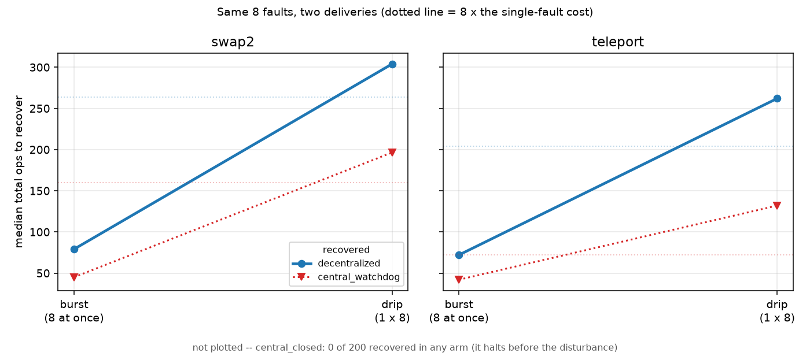

# Experiment 1 — self-sorting agents with local defects

`selfsort.py`. Plain Python plus matplotlib for the figures. Seeded and
reproducible; `python selfsort.py test` checks the substrate itself.

Ten integers on a line. Each integer is an agent that can see only itself and
one adjacent neighbour, and whose only action is "attempt to exchange with that
neighbour". The global target is the sorted array; distance to it is the
inversion count. Nothing in the system holds the target — it exists only in the
measurement.

Everything is priced in one currency: **one attempted inspection of an adjacent
pair, which may lead to an exchange**. Centralized, decentralized and random
controllers all spend that same primitive, including the coordinator's
monitoring scans, so operation counts compare directly.

## What is varied

**Controllers** — who decides which pair is touched next, and whether anyone is
still watching afterwards.

| | |
|---|---|
| `decentralized` | A random adjacent pair acts; a random one of the two is the initiator and applies its own rule. No coordinator, no halting condition. |
| `central_open` | A coordinator runs the textbook schedule of *n* passes and then declares completion. Has a plan and no feedback. |
| `central_closed` | Re-scans until a full pass finds no inversion, then halts. |
| `central_watchdog` | The same coordinator that never concludes it is finished. |
| `null_random` | Same locality, no rule: exchange with a random neighbour regardless. The control for "is it the coupling or just the locality?" |

**Defects** — `p_fail` (every attempted action fails with probability *p*),
`unreliable` (one agent fails 90% of its own actions), `frozen` (an agent never
initiates but can still be moved), `dead` (never initiates and cannot be moved,
so it blocks the line).

**Perturbations** — applied once, the moment the goal is first reached, or a
chosen number of operations later: swap two positions, move one element
elsewhere, or damage a member *and* the state together.

## What came out (N=10, 300 trials per cell)

**Local action noise is nearly irrelevant to whether the goal is reached.**
Decentralized, `central_closed` and `central_watchdog` all sort 100% of the time
at p=0.7, where 7 of every 10 attempted actions silently fail. Only the
open-loop plan degrades — 100% → 54% → 0% across p=0, 0.3, 0.7. The dividing
line is feedback, not centralization. `null_random` essentially never sorts —
its success rate is 0.0% to 1.7% across the noise grid, non-zero in five of seven
cells (`results/faults.csv`), which is a rate consistent with occasionally
stumbling into a sorted array rather than with sorting — so the competence comes
from the local rule and not from the locality.

**The decentralized version is robust but not cheap, and the penalty shrinks as
noise rises.** Against `central_closed` it pays **1.58×** the coordinator's
operation count to reach the goal at p=0, and that ratio falls monotonically —
1.58, 1.58, 1.53, 1.49, 1.44, 1.38, **1.17** across p = 0, .05, .1, .2, .3, .5,
.7. Recovery cost ranges **1.15× to 2.45×** across the five perturbations and
three noise levels, median 1.44×. Robustness here is bought, not free — but the
price is not a constant, and an earlier version of this paragraph quoted "about
1.6× … and about 1.7× … at every noise level", which asserted an invariance the
data does not show. Computed from `results/faults.csv` and `results/recovery.csv`.

**The sharpest result is about *when*, not *whether*.** Disturb the array
D operations after it first reaches sorted:

| D | decentralized | central_closed | central_watchdog |
|---|---|---|---|
| 0 | 1.00 | 1.00 | 1.00 |
| 5 | 1.00 | 1.00 | 1.00 |
| 20 | 1.00 | **0.00** | 1.00 |
| 200 | 1.00 | **0.00** | 1.00 |

At D=0 every closed-loop controller looks equally competent, which is what the
naive version of this experiment measures. `central_closed` is goal-directed for
a window roughly 5–20 operations wide and is merely goal-*shaped* thereafter.
The decentralized collective has no such window because it has no
representation of "done" to be wrong about. That distinction — being at the goal
versus still steering toward it — is the thing worth carrying forward.

**A degraded member is routed around; a blocking member is not.** Freezing an
agent or making it fail 90% of its actions costs some operations and changes
nothing else: recovery stays at 100%. A dead agent that will not move partitions
the line, and recovery drops to 52% for every controller equally. That is the
honest boundary of the competence.

**Heterogeneous rules break it by headcount, not by proportion.** The first
sweep at N=10 said "one agent in ten is tolerated, two in ten is not", which
described the result as a fraction. At N=10 a count and a fraction are the same
number, so that sweep could not tell them apart. Growing the population while
holding the count fixed settles it:

| opposing agents | N=10 | N=20 | N=30 | N=50 |
|---|---|---|---|---|
| 0 | 1.00 | 1.00 | 1.00 | 1.00 |
| 1 | 1.00 | 1.00 | 0.99 | 0.94 |
| 2 | **0.08** | **0.03** | **0.07** | **0.08** |
| 3 | 0.00 | 0.00 | 0.00 | 0.00 |

(probability the goal is ever reached). Two opposing agents break the collective
just as completely at 4% of the population as at 20%. Plotted against headcount
the four curves lie on top of each other; plotted against fraction they fan out
by an order of magnitude. The proportion was never the operative quantity.

**Reaching the goal and holding it break at different headcounts.** A single
opposing agent is tolerated for reachability but destroys the goal as an
attractor. Measuring occupancy — the fraction of the back half of a run spent
sorted, rather than one sample at the final operation — gives 0.097, 0.049,
0.033 and 0.024 for N = 10, 20, 30 and 50. That is about 1/N: one contrarian
reduces the collective to visiting its goal as often as it visits any single
configuration. It also costs: median operations to first reach the goal rise
from 2,635 to 20,248 at N=50. So one defector is survivable but expensive and
non-absorbing; two are fatal. Why the boundary sits exactly at two is not
tested here.

**The single-point-of-failure number is true by construction.** Kill one unit at
random: decentralized 1.000, centralized **0.9133**, against the model's closed
form 10/11 = **0.9091** — the coordinator's share of the units. The measured
value is a 300-trial estimate of that closed form (26 coordinator kills, not the
27.3 expected), so it carries sampling error and is not "exactly" anything; an
earlier version of this line said it was. Freezing any one *agent* is survivable by
everyone. This is arithmetic from the model, not a discovery, and should be
reported that way.

## Repeated disturbance (D2): what one shot could not say

Added 2026-09-06. Until now the schedule fired **once** — `fired = perturbation
is None` — so "recovery rate" was a rate over independent trials, never over
repeated demands on the same system. The ontology defines robustness as
performance *across* perturbations, which a single shot cannot express.
`perturb_repeats` re-arms after each recovery; `python selfsort.py repeat` runs
the profile. Setting it to 1 reproduces every previously recorded number
exactly, checked field by field on 225 trials.

Delivered at D=20 operations after the goal is reached, with `stop_on_goal=False`,
200 trials per cell. Three distinct profiles come out, and none of them is
visible from one episode.

**A controller that halts can be measured at most once.** `central_closed` stops
on "no inversion found", so in **200/200** trials it had already halted when the
disturbance arrived, was perturbed after stopping, never recovered, and never
reached a second episode. Its old headline — recovery `0.00` at D=20 — reads as
a poor score on a robustness test. It is not: it is the absence of a test. The
honest quantity is *episodes absorbed*, and for this controller it is pinned at
one by its own design, in every condition measured.

**Recovery rate saturates and hides degradation.** Under `unreliable_member`,
every controller that keeps acting recovers from **all eight** episodes in
**200/200** trials — recovery rate 1.00 throughout, which single-shot reporting
would call fully robust. The cost tells a different story:

| episode | 0 | 1 | 2 | 3 | 4 | 5 | 6 | 7 |
|---|---|---|---|---|---|---|---|---|
| `decentralized` median ops to recover | 52 | 58 | 69 | 82 | 100 | 106 | 117 | 153 |
| `central_watchdog` | 44 | 48 | 62 | 72 | 72 | 86 | 114 | 126 |

Cost nearly triples while the rate stays flat at 1.00. Attrition is zero at every
episode, so this is measured over the full population and is not a survivorship
effect. The mechanism is not subtle — each episode makes one more member
unreliable — but the point is that the measure everyone was reporting could not
see it.

**Transient disturbance gives a flat profile, which is what a passive attractor
predicts.** Under `swap2` and `teleport` the cost is stationary across all eight
episodes, with no attrition — but the two perturbations differ in level and the
ranges are not shared: at p_fail=0.3, `swap2` costs `decentralized` 44–56 and
`central_watchdog` 31–42, while `teleport` costs 32–48 and 21–28. Flat in both
cases; roughly 30% cheaper under `teleport`. On this evidence, repeated transient perturbation does **not** distinguish these
controllers from a passive attractor. That is a negative result for D2's
question, and it is the honest one.

**A trap this experiment sets, and how to read past it.** Episode *i* is only
faced by trials that recovered from episode *i−1*, so where attrition is heavy
the later cost figures are conditioned on continued success. `frozen_member`
at p_fail=0.3 falls from 200 trials at risk to **13** for `decentralized` (rate
decaying 1.00 → **0.46**) and to **12** for `central_watchdog` (1.00 → **0.42**)
by episode 7 — and median cost *falls* over the same range. Both controllers, one
noise level; the figures are per-cell and an earlier version of this sentence
mixed one controller's attrition with the other's rate. That
apparent improvement is survivorship, not adaptation. **Read
`trials_reaching_episode` before reading `median_ops_to_recover`.** The
per-episode recovery rate is computed over the at-risk population and is
unbiased in both cases; the figure plots the at-risk count underneath the cost
for exactly this reason.

Outputs: `results/repeat.csv` (per-episode), `results/repeat_summary.csv`
(episodes absorbed and why each sequence ended), `results/07_repeat.png`.

## Delivery (D2, second half): eight faults at once, or one at a time?

Added 2026-09-06, `python selfsort.py delivery`. The previous section left one
thing unseparated, and [the "Next" list below](#next) named it as the
discriminating run: rising cost under `unreliable_member` has an obvious
mechanism — each episode damages one more member — so it measures capacity being
consumed, not the system responding to repetition. This run holds **total damage
fixed at eight faults** and changes only their arrival:

| arm | episodes | faults each | what it is |
|---|---|---|---|
| `single` | 1 | 1 | the unit of account, so the other two have something to divide by |
| `burst` | 1 | 8 | all the damage at once |
| `drip` | 8 | 1 | the same damage one hit at a time |

Only `swap2` and `teleport` are used. Member damage is not divisible into equal
units — freezing eight agents at once and freezing one agent eight times are
different experiments, and the second is not even well defined once the same
agent can be drawn twice.

**Eight faults is not eight times the displacement, and that has to be measured
before anything else is read.** Swaps partially cancel and inversions saturate
(45 is the maximum at n=10), so one swap leaves a mean 5.98 inversions while
eight at once leave 20.03 — not 47.8. Fixing the fault count fixes the
*intervention*, not the distance from the goal. The drip arm therefore delivers
**49.3** cumulative inversions against burst's **20.0** for the same eight
faults. Raw ops differ enormously — 79 versus 304 for `decentralized` — and
almost all of that is displacement, not delivery. `mean_total_damage_inv` is
recorded per row so the comparison can be made on the right quantity.

**The passive-attractor model, stated so it can fail.** If cost depends only on
current displacement, then total cost is the sum over deliveries of `f(damage of
that delivery)` and there is no cross-episode term. `f` is measured from single
deliveries, so predicting drip costs **8 × f(1)** with no free parameters:

| controller | perturbation | `8 × f(1)` predicted | observed | error |
|---|---|---|---|---|
| `decentralized` | swap2 | 304.0 | 311.3 | **+2.4%** |
| `decentralized` | teleport | 252.8 | 264.0 | **+4.4%** |
| `central_watchdog` | swap2 | 177.8 | 199.9 | **+12.4%** |
| `central_watchdog` | teleport | 111.3 | 133.1 | **+19.6%** |

The decentralized rule fits. The watchdog does not, and the gap is not noise.

**Where the watchdog's excess is, and what it is not.** Per-episode means over
400 trials, all of which recovered from all eight episodes, so none of this is
survivorship. Episode 0 reproduces the single-delivery mean to **+0.0%** in all
four cells, which is the internal control that the harness is not biasing the
first hit:

```
swap2     decentralized     40.0 41.3 40.1 39.6 39.9 40.0 38.3 37.8    0->7  -5.5%
swap2     central_watchdog  23.7 24.7 25.1 26.0 26.3 24.7 26.0 26.2    0->7 +10.5%
teleport  decentralized     32.5 35.6 33.7 33.0 32.3 31.6 33.2 33.9    0->7  +4.4%
teleport  central_watchdog  14.2 16.2 17.1 16.6 18.1 17.7 17.1 17.3    0->7 +21.1%
```

The watchdog gets steadily *worse* under repetition while the decentralized rule
is flat. Under the ontology that is not adaptation — adaptation restores or
improves performance after loss — but it is history dependence, and history
dependence is the thing a passive attractor is not supposed to have. So it was
isolated rather than explained away.

**It is the scan cursor, and this is measured, not inferred.**
`central_watchdog` sweeps `i = 0 .. n-2` forever, so its phase when damage
arrives is state that survives a disturbance; `decentralized` picks pairs at
random and has no phase. `results/delivery_cursor_probe.py` runs a watchdog
identical in every respect except that each sweep starts at a random offset —
the same n−1 positions scanned, the same work, only the order changed:

| perturbation | watchdog, episode 0→7 | same, cursor phase randomised |
|---|---|---|
| swap2 | **+10.5%** | **−0.6%** |
| teleport | **+21.1%** | **−1.2%** |

The whole effect disappears. And the direction matters: the phase-randomised
watchdog is *more expensive at episode 0* (27.4 against 23.7 on swap2; 19.0
against 14.2 on teleport) and the ordinary watchdog's cost at episode 7 (26.2,
17.3) converges on it. So the watchdog is not degrading. It begins with its
cursor favourably correlated with the array it has just finished sorting, and
repetition destroys that correlation. **The rise is the decay of an initial
condition, not damage accumulating.**

### What this answers

**Delivery carries no information beyond displacement.** For the controller
without internal state the zero-parameter attractor model predicts the
eight-episode total to within 2.4%, and the one apparent history effect in the
other controller is a decaying initial-condition correlation that vanishes when
scan order is randomised. Nothing here is stronger than a passive attractor.

This is the **second independent** negative answer for D2. The first was cost
stationarity across eight episodes; this one holds total damage fixed and varies
delivery, which the first could not do.

**Read the preregistered criterion honestly.** The "Next" list said: *"A passive
attractor cannot tell those apart. If they differ, that is the first thing here
stronger than an attractor."* The arms **did** differ in raw cost, by a factor of
about four. As written, that criterion is met. It should not have been written
that way: it compared totals without dividing by the displacement each delivery
creates, and eight faults at once are not eight faults' worth of displacement.
Once the comparison is made on the quantity the model is about, the difference is
accounted for with no free parameters. The criterion was underspecified, and it
is left above as written rather than edited to match the outcome.

**What it does not establish.** Two perturbations, both pure state damage, one
substrate, n=10. `central_closed` is absent from every cost figure because it
halts before the disturbance arrives and recovered in **0 of 200** trials in all
three arms — its own documented design ceiling, and the reason it is annotated on
the figure rather than left as an empty legend entry. Nothing here bears on
member damage, where capacity really is consumed.



## Three things I had to fix before believing any of it

Each of these made the decentralized controller look better than it is.

1. The coordinator always asked the **left** agent to act, while the
   decentralized rule asked a random one of the two. A single defective agent
   therefore stalled the centralized controllers permanently. That was an
   asymmetry in my code, not a structural property.
2. Freezing an agent at the moment the array is already sorted changes no state,
   so "recovery" was trivially instant and measured nothing. Member defects now
   damage the substrate and the state together.
3. Monitoring scans were free, so `central_watchdog` looped forever without
   spending anything, and a coordinator that never halts appeared to cost
   nothing. Looking is now charged at the same rate as acting.

## Running it

```bash
python selfsort.py test           # substrate self-checks, ~1s
python selfsort.py all            # every experiment + four figures, ~2min
python selfsort.py window         # the goal-directedness window on its own
python selfsort.py repeat         # the repeated-disturbance profile (D2), ~1min
python selfsort.py delivery       # same damage, two deliveries (D2), ~2min
python selfsort.py scale          # headcount vs fraction, N up to 50, ~3min
```

Outputs land in `results/` as one CSV and one PNG per experiment (`repeat`
writes two CSVs: the per-episode profile and the per-condition summary).
Figures need matplotlib; `uv run --with matplotlib python selfsort.py ...` works
without installing anything.

## Next

Rewritten 2026-09-06. The previous version ended by proposing "the two-resource
production network with specialization, which is the smallest bridge from this to
an economics question". That is out of scope, not merely deferred: the charter's
pre-biological boundary, set by the owner 2026-09-05, excludes price, market and
resource-stock framings. It is recorded here rather than deleted because it was
the stated next action for ten days and a fresh reader would have acted on it.

What this experiment actually opens, in order of what a result would change:

1. **The two-agent boundary.** Still the first open question, and untouched: one
   opposing agent presumably parks somewhere the majority contains, two can hand
   a defect back and forth, but nothing here tests that. Cheap to run.
2. ~~**Separate the two things the repeat profile conflates.**~~ **Done
   2026-09-06** — [the delivery section above](#delivery-d2-second-half-eight-faults-at-once-or-one-at-a-time).
   Answered in the negative: delivery carries no information beyond displacement.
   The original wording is kept below because its criterion turned out to be
   underspecified and the section above says why. *"Rising cost under
   `unreliable_member` has an obvious mechanism — each episode damages one more
   member — so it measures capacity being consumed, not the system responding to
   repetition. The discriminating run holds total damage fixed and varies only
   how it is delivered: eight faults applied at once versus one per episode. A
   passive attractor cannot tell those apart. If they differ, that is the first
   thing here stronger than an attractor."*

   What it opened instead: the scan cursor is real internal state that a
   coordinator carries across disturbances, and it buys a measurable advantage on
   the **first** disturbance only. Whether any controller here can hold that
   advantage across repetition is a question this run did not have to ask.
3. **Coarse-graining.** Feed the transition system to causal-emergence tooling now
   that the state space is small and well defined. Enabling work; name the
   question it unlocks before running it.
